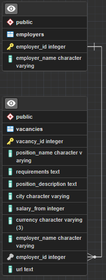

# Проект работы с базой данных
## Цель работы
Получить данные с сайта HH.ru. Создать БД PostgreSQL с таблицами. Заполнить таблицы. Создать различные методы по получению данных из БД.

## Графическая схема БД

## Используемые технологии
* python (3.8.5)
* requests
* psycopg2

## Основные шаги проекта
*   Получение данных о работодателях и их вакансиях с сайта hh.ru по ключевому слову. Для этого используется публичный API hh.ru и библиотека requests.
* 	Выбираются 10 работодателей, вакансии которых отсортировываются.
* 	Проектируются таблицы в БД Postgres для хранения полученных данных о работодателях и их вакансиях. Для работы с БД используется библиотека psycopg2.
* 	Реализуется код, который заполняет созданные таблицы в БД Postgres данными о работодателях и их вакансиях.
* 	Создаётся класс DBManager для работы с данными в БД.

## Класс DBManager
Класс DBManager будет подключаться к БД Postgres и иметь следующие методы:
* 	get_companies_and_vacancies_count(): получает список всех компаний и количество вакансий у каждой компании.
* 	get_all_vacancies(): получает список всех вакансий с указанием названия компании, названия вакансии и зарплаты и ссылки на вакансию.
* 	get_avg_salary(): получает среднюю зарплату по вакансиям.
* 	get_vacancies_with_higher_salary(): получает список всех вакансий, у которых зарплата выше средней по всем вакансиям.
* 	get_vacancies_with_keyword(): получает список всех вакансий, в названии которых содержатся переданные в метод слова, например “python”.

Класс DBManager использует библиотеку psycopg2 для работы с БД.
